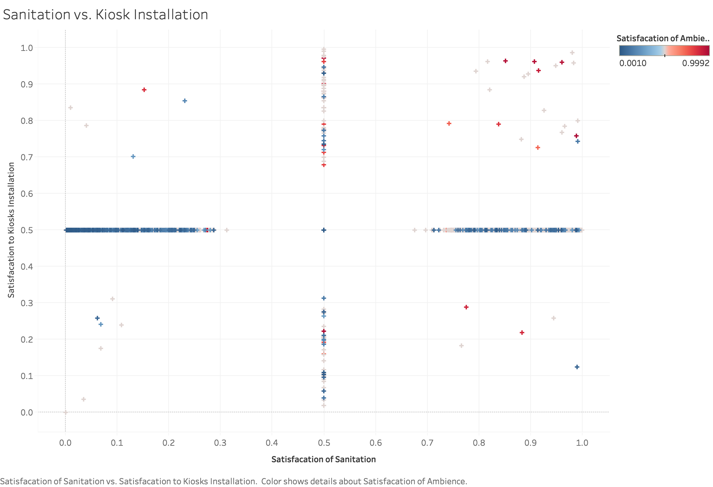
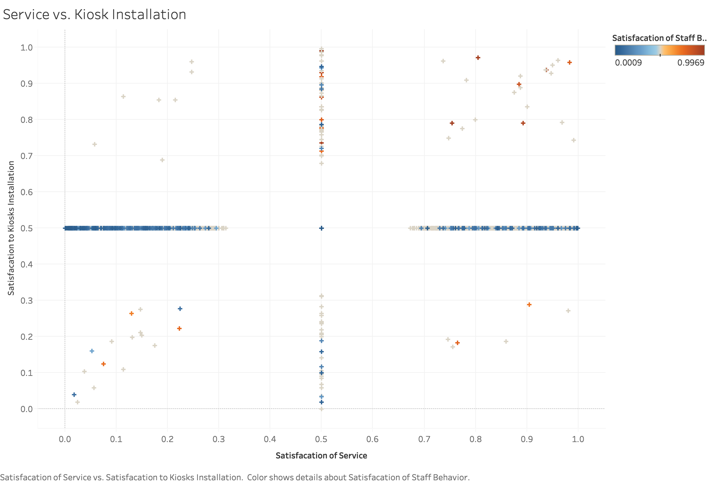

# Object:
The objective of this project was to analyze the order automation in fast food chains with a special focus on the recent move of McDonald’s for kiosk installation at all their locations in the United States. The analysis is conducted on the Yelp reviews of different McDonald’s locations. We are computing the success of this business decision of McDonald’s based on customer feedback on order automation by gauging their sentiments using Natural Language Processing.

## MODEL BUILDING: 

* Dependent (Sentiments):  
Y: Kiosks (keywords: kiosk, automate, self-service)
* Independent Variables (Sentiments): 
X1: Sanitation (keywords: clean, spotless, filthy, garbage) 
X2: Service (keywords: service, serve) 
X3: Ambience (keywords: packed, crowd, line, patience) 
X4: Staff Behavior (keywords: manager, employee)

## Satisfacation of Sanitation and Ambience to Kiosk Installation in LA

In this plot, it shows that the crowded restaurant has better satisfacation of Kiosk installation, which means this policy really help the customer.

## Satisfacation of Service and Staff Behavior to Kiosk Installation in LA

In this plot, it shows that the bad service makes the feedback of kiosk installation became useless, even though the restaurants had good staffs. So in these restaurants, installation kiosk cannot increase customer satisfacation, instead, they need to increase their service level.
